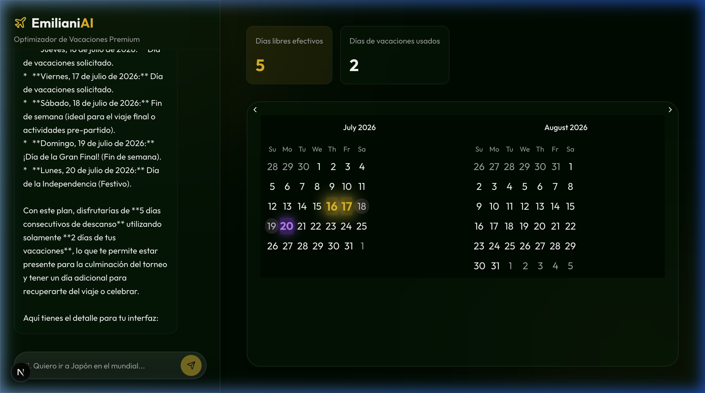
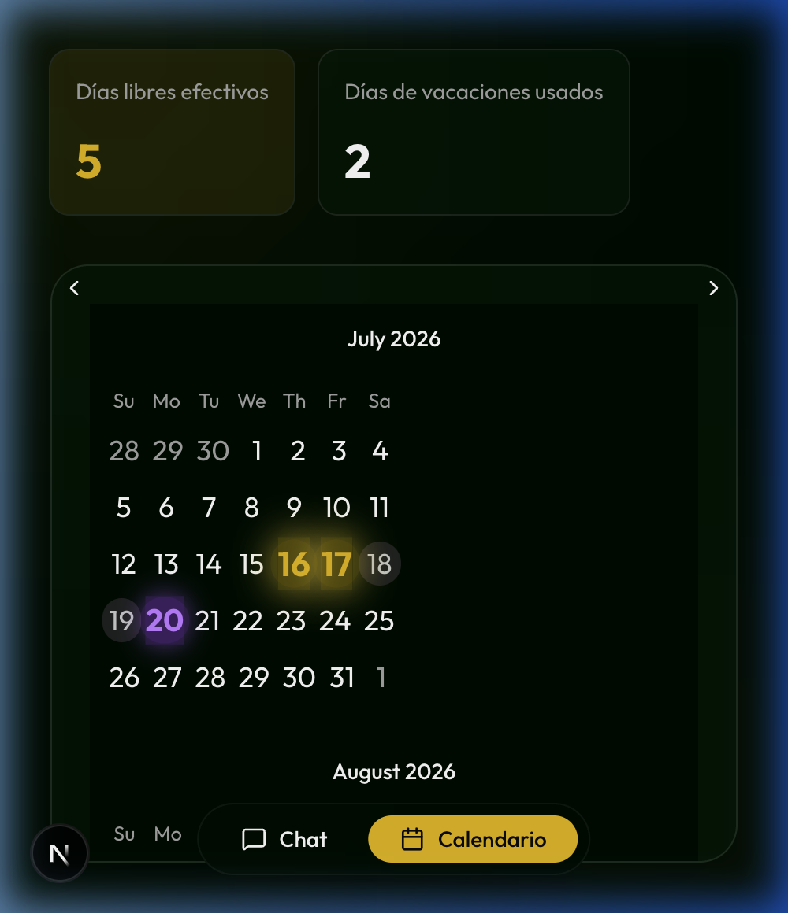

# 🇨🇴 EmilianiAI - Optimizador de Vacaciones Premium

**Maximiza tu tiempo libre usando la inteligencia artificial y la Ley Emiliani.**

EmilianiAI es un **MVP (Producto Mínimo Viable)** diseñado específicamente para trabajadores en Colombia. Utiliza el poder de la IA para analizar el calendario de festivos colombianos y sugerirte las mejores fechas para pedir vacaciones, convirtiendo tus 15 días legales en periodos de descanso mucho más largos.

---

## ✨ Características Principales

- 🤖 **IA con Conciencia Temporal:** El asistente sabe exactamente qué día es hoy y calcula tus planes en tiempo real.
- 📅 **Optimización Emiliani:** Algoritmos que aprovechan los puentes festivos de Colombia (Ley 51 de 1983).
- 🏆 **Tematización Dinámica:** La interfaz cambia de color según tus planes (Mundial 2026, Viajes a Japón, etc.).
- 📱 **Mobile First:** Diseño optimizado para celulares con navegación fluida entre chat y calendario.
- 🚀 **Tecnología de Punta:** Construido con Next.js 15, Gemini 1.5 Flash, Zustand y Tailwind CSS.

---

## 📸 Vista Previa

| Escritorio (Modo Mundial) | Móvil (Navegación) |
|:---:|:---:|
|  |  |

---

## 🛠️ Cómo Empezar

### Requisitos Previos
- Node.js 18+ instalado.
- Una `GEMINI_API_KEY` (puedes obtenerla en [Google AI Studio](https://aistudio.google.com/)).

### Instalación

1. Clona el repositorio:
   ```bash
   git clone https://github.com/tu-usuario/emiliani-ai.git
   cd emiliani-ai
   ```

2. Instala las dependencias:
   ```bash
   npm install
   ```

3. Configura las variables de entorno:
   Crea un archivo `.env.local` en la raíz y añade tu llave:
   ```env
   GEMINI_API_KEY=tu_llave_aqui
   ```

4. Inicia el servidor de desarrollo:
   ```bash
   npm run dev
   ```

5. Abre [http://localhost:3000](http://localhost:3000) en tu navegador.

---

## 📋 Nota sobre el MVP
Este es un proyecto en fase inicial pensado para validar la idea de optimización de vacaciones en el contexto colombiano. 

- **¿Por qué Colombia?** Porque es uno de los países con más festivos del mundo y la "Ley Emiliani" ofrece una oportunidad única para optimizar el descanso.
- **¿Es infalible?** La IA es una gran guía, pero siempre verifica con el departamento de recursos humanos de tu empresa antes de comprar tiquetes. ;)

---

Desarrollado con ❤️ para los que aman viajar tanto como descansar.
